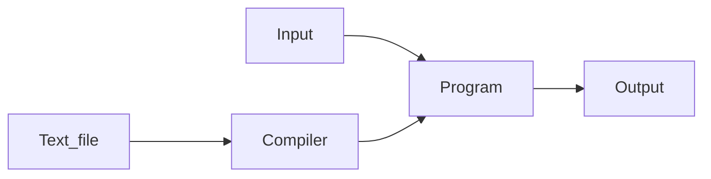
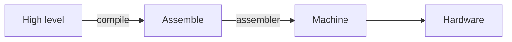

<h1 align="center">CS-11</h1>
<h3 align="center">Intro to Programming/C++</h3>

<br>

# Week 1: 08.28.23

## Introduction 
- Name: Andrew or Tac (stupid guy)
- From: Yosemite
- Education: UCLA and UCSC
- Did some projects with AI
- Contact him if you are planning on going to grad school or need a reference

<br>

## Course overview
- Assignments
  
  | Type | Percent | Notes |
  | :-- | :-- | :-- |
  | **Zybooks** | 35% | Low stakes, you can attempt the question as many times as you need |
  | **Assignments** | 35% | 8 programming due at 6:00pm. Two late assignments allowed. Be sure to let andrew know you are using a late passS|
  | **Exams** | 20%  | More info on these soon | 
  | **In-class exercises** | 10% | Free points, just scan the QR | 

- Attend SI! Free tutoring and help with CS-11
  - Monday: 1:00 - 2:15
  - Thursday 1:00 - 2:15
- No using large language models. Violates academic integrity

<br>

## Motivate computer science
### Why is computer science important or worth studying?
- Data structures (theory)
- Game dev/entertainment
- Advanced calculations and statistics 
- Networking and communication 
- Security 
- Web design 
- Computer aided design
- Simulations 
- Robotics
- Artificial intelligence (Everything is **NOT** AI)
  - Self driving
  - Forecasting
  - Search algorithms 
  - Recommendations

<br>

### Future grant 
Exploring what you are interested in, one credit course


<br>

## History 
- A computer was an occupation meaning one who computes. A computer would make maps and model projectiles using calculations
- In **1945 the first electronic computer** was invented. The first computer was used to calculate artillery firing tables for world war II. Early computers took up an entire room and costed half a million or with inflation six million dollars. 
- Fast forward to 2020 and now we are in the AI boom with self driving, personal assistants, large language models, art and more. 

<br> 

## What is a program 
- A program is a series of instructions



<br> 

## Binary counting
### Basic counting in binary: 
There are only two digits in binary, 0 and 1. This means your run out of digits much faster than our base ten system (which has 9 digits). This means the numbers "cary over sooner"

Number | | | | | | | | | | |
| :-- | :--: | :--: | :--: | :--: | :--: | :--: | :--: |:--: | :--: | :--: |
| Base 10 | 1 | 2 | 3 | 4 | 5 | 6 | 7 | 8 | 9 | 10 |
| Binary (base 2) | 0001 | 0010 | 0011 | 0100 | 0101 | 0110 | 0111 | 1000 | 1001 |

<br> 

### Numeric places in binary
| | | | | | 
| :--: | :--: |  :--: |  :--: |  :--: | 
| 16 | 8 | 4 | 2 | 1 |


<br>

## Development environments 
- Your development environment will depend on the OS you use. 
- There are many different set ups depending on your preferences
- Andrew recommends using Command Line Interfaces (CLI) rather than Graphical User Interfaces (GUI)

<br>

## TODO
- Read syllabus 
- Zybook chapter one due Monday (Sept 4)
- Set up dev environment


<br><br> 

# Week 1: 08.30.23

## Announcements 
- Deadline set at 6:00 pm so you do not pull all nigheters
- Zybooks 
  - Price: Buy on credit and have financial aid cover for you 
  - Resubmit: Canvas auto updates grades as you pro
- SI Session: The first SI session will be on 09/07/23
  
## Dev environment
- A dev environment consists of...
    1. Text editor -> Used to write the text of a program
    2. Compiler -> Specifically for compiled languages. Compiles )__source code__ into an __executable__




<br>

## Unix controls
### File and folder directory management 

| Action | Command | Notes| 
| :-- | :-- | :-- | 
| Change directory | `cd location` | Changes the location "you are at" in the file system | 
| New file | `touch file_name.cpp` | 
| Rename (move) | `mv old_file.cpp new_file.cpp`
| Print working directory | `pwd` | Where are you in your file system | 
| List stuff | `ls` | List contents of the directory | 
| Make directory (folder) | `mkdir dir_name`| Make a directory |

<br>

## Writing your first program 
The first program programmers write when they start a new language is called hello world. Heres a breakdown of the basic parts:

Include necessary library to use input and output in your program
```cpp
#include <iostream>
```
We will discuss this line more later in the course 
```cpp
using namespace std;
```
Start of the main function. Think of this as a box where all your code goes 
```cpp
int main() {
```
Output the text "hello world" to the screen and add a newline with endl

```cpp
cout << "Hello world" << endl;
```
End the program 
```cpp
return 0;
```
End the main function. We started the main function with a open curly brace, we end it by adding a closing curly brace 
```cpp
}
```

Complete program:
```cpp
#include <iostream>
using namespace std;

int main () {
  cout << "Hello world" << endl;
  return 0;
}
```

<br><br>


# Week 2: 09.06.23

## Announcements 
- Andrew does not get notifications for submission comments. So do not leave them
- This class is kinda graded by a robot which does not read the comments 
- Chapter one got extended by a day. It is fine if you did not do it, late submissions are okay it requires an override on Canvas which looks bad for Andrew
- Friday is the last day you can drop

<br>

## Anatomy of a C++ program
Comment
```cpp
// Comment 
```
Pre processor directive. Usually starts with a #
```cpp
#include <iostream> 
```
Use the standard namespace. We will not worry about this for now
```cpp
using namespace std;
```
Main function. Every c++ function has a main function. A function has a return type and something to return. 
```cpp
int main() {

}
```
Print statements. Output the text (which us in quotes) to the monitor. These go inside the `main()` function 
```cpp
cout << "Hello world";
```
## Variables 
- A variable is location in memory that stores some values 
- The most basic type of variable is an integer 
- It is important to remember to assign your variables values. Otherwise the value is undefined, and its value is the value that location in memory contains
- To print a variable do not use quotes
   ```cpp
  cout << var << endl; // Variables do not go in quotes when printing
  ```
- Ways of assigning a variable a value
  ```cpp
  int var_a = 0; // 
  int var_b(0);
  int var{0}; 
  ```
<br>

## Data types 
### Integer data types (no decimals)
| Data type |  What | Usage | Range (about) | Bites | 
| :--- | :--- | :--- | :-- | :--- | 
| `int` |  Standard integers | `int a;` | [-2 billion - 2 billion] |  4 | 
| `unsigned` | Positive integers | `unsigned b;` | [0, 4 billion]| 4 | 
| `short` | Small integers | `short c;` | [-32k, 32k] | 2 | 
| `unsigned short` | Less size, bigger positive numbers | `unsigned short d = 1` | [0, 65] | 2 |  
| `long long` | Very big integers | `long long e;` | [-9 quintillion, 9 quintillion] | 8 
| `long`| Big integers | `long f;` | dependant on the compiler | 4 or 8 | 

Note: One bit is used to represent the sign
 
<br>

### Floating point data types
| Data type |  What | Usage |
| :--- | :--- | :--- | 
| `double` |  Decimal numbers (use this one) | `double a;` |
| `float` | Smaller decimal numbers | `float b;` | 

<br>

### More native data types
| Data type |  What | Usage | Example | 
| :--- | :--- | :--- | :--- |
| `char` | Characters | `double letter = 'a';` | `'A'`, `'a'`, `'@'`
| `bool` | True or false values | `float b;` | `true`, `false` | 

### Non-native data types
| Data type |  What | Usage | Notes | 
| :--- | :--- | :--- | :--- |
| `string` | Words/text | `string name = "Steph";` | Not native to c++, you need to `#include <iostream>`

<br>

### Constants
- Constants are used fpr security 
- A variable is made constant if it never changes
- A constant's value can never be reassigned 
- Constants are usually capitalized according to the [style guide](https://google.github.io/styleguide/cppguide.html)
  ```cpp
  const double PI = 3.141592;
  ```

<br>

### Casting
- Variable data types can change forms with type casting
- Some type conversions are prohibited 
- What happens when you cast a character? Everything in the computer is represented by letters. The [ASCII](https://en.wikipedia.org/wiki/ASCII) table defines what character is assigned to each number
  ```cpp
  int letter = 'A';
  cout << int(letter) << endl; // Prints 65
  ```

<br>

## Pitfalls 
### Integer division

What is the result of the following line?
```cpp
cout << 5/2 << endl; // Prints 2
```
It prints `2` NOT `2.5`. This is because the numerator and denominator are integers. When an integer is divided by another integer, the resultant is an integer, meaning if there was a trailing decimal, it is dropped. The solution to this is to make either the numerator or denominator a double (add a .0), or to cast the value 
```cpp
cout << 5/2.0 << endl; // Prints 2.5
```

<br>

### Overflow

This happens if you exceed the range supported by the datatype you are using. The numbers "overflow", or wrap around to the beginning of the range

<br>

### Float Precision

You would have to be unlucky to experience this
```cpp
double num = 4.35;
cout << int(num * 100) << endl; // Prints 434!!
```
You can counter act this by adding a small value to the number 
```cpp
double num = 4.35;
cout << int(num * 100 + 0.5) << endl; // Prints 435
```


<br>

## Comments 
- Comments are not read by the compiler 
- Comments are notes for you the programmer or other people reading your code
- Comments should be used to explain things your code does
   ```cpp
  // This is single line comment
  /*This 
  Is 
  A 
  Multiline 
  Comment*/
  ```
<br>

##  Input and Output 
### cout
- `cout` is to send output to the terminal
- Pronounced as "c-out"
- An endline (`endl`) is the same as clicking return on your keyboard, it brings you to a new line

<br>

### cin
- `cin`` is to get input from the user
- Pronounced "c-in"
- The syntax is:
   ```cpp
  cin >> var_name;
  ```
  Where `cin` is the input stream, and `var_name` is the variable to input to

<br>

### getline()
- [Documentation for getline](https://en.cppreference.com/w/cpp/string/basic_string/getline)
- `cin` is limited 
- What happens when the program's input is `CS 11`
  ```cpp
  #include <iostream>
  using namespace std;

  int main() {
    string class_name;

    cout << "Enter the name of your class";
    cin >> class_name; 
    cout << class_name << endl;

    return 0;
  }
  ```
  The output is CS, NOT CS 11
- `cin` only collects one token (stuff after a space or enter is ignored)
- `getline()` is good for when you need to gather one than one token 
- `getline()` takes two arguments, the stream to use (this will be `cin` for a while) and the variable to input into.
- The updated code of the example above is:
   ```cpp
    #include <iostream>
    using namespace std;

    int main() {
      string class_name;

      cout << "Enter the name of your class";
      getline(cin, class_name);
      cout << class_name << endl;

      return 0;
    }
   ```

<br>


## TODO
- Assignment zero is due on Friday. It is just like "hello world". Make sure the zip file is named correctly (case sensitive)
